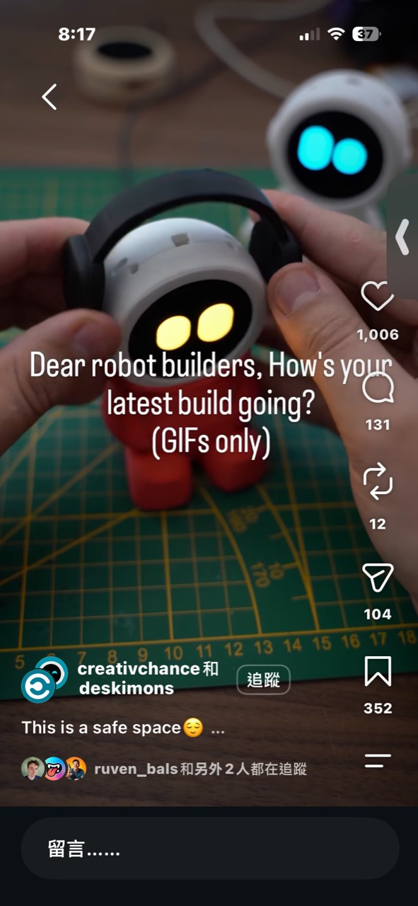
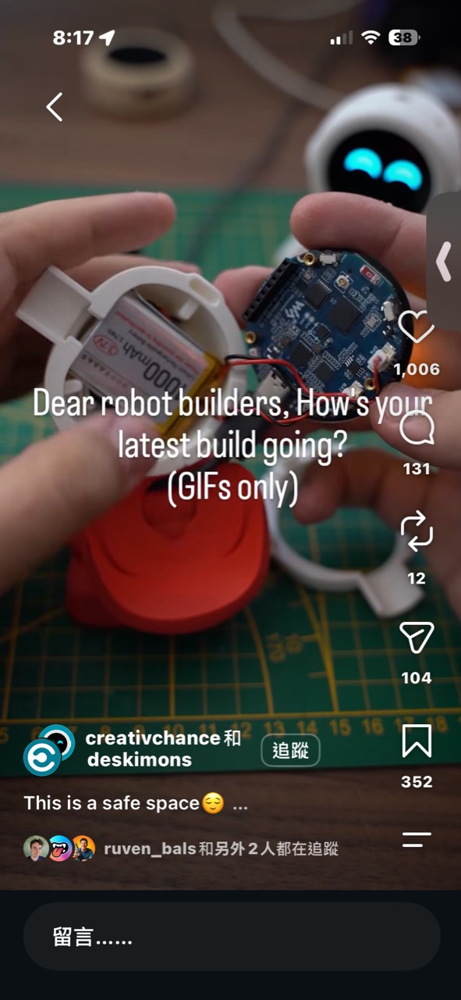

# Deskimon 模組化桌面表情機器人

記錄日期：2026-10-03

## 靈感來源

Instagram 帳號 `creativichance` 與 `deskimons` 展示一系列圓形臉孔的桌面機器人。照片中的角色戴著黑色耳機、紅色身體，圓形 AMOLED 顯示黃色眼睛；拆開後可看到圓形整合板與一顆 3.7V 1000mAh LiPo 電池。

這個系列名為 Deskimon。官方把它定位成可自行製作的互動桌面機器人：一塊整合螢幕板、3D 列印身體與 Deskimon 軟體即可完成，不需焊接。

- [Deskimon 官方產品頁](https://creative-chance.com/en-usd/products/neo-deskimon)
- [Waveshare ESP32-S3 Touch AMOLED 1.75 官方頁](https://www.waveshare.com/esp32-s3-touch-amoled-1.75.htm)
- [Waveshare 技術文件](https://docs.waveshare.com/ESP32-S3-Touch-AMOLED-1.75)

## 硬體核心

Deskimon 使用 Waveshare `ESP32-S3-Touch-AMOLED-1.75`：

- ESP32-S3 雙核心處理器，最高 240MHz。
- 1.75 吋圓形電容觸控 AMOLED。
- 466 × 466 像素、1,670 萬色。
- 8MB PSRAM 與 16MB Flash。
- 2.4GHz Wi-Fi 與 Bluetooth LE。
- QMI8658 六軸 IMU。
- 雙麥克風、喇叭輸出與音訊相關電路。
- RTC、microSD、電源管理與鋰電池充放電接口。
- 按鍵及 GPIO／UART／I2C 擴充。

官方售價依版本約 US$29.99～39.99。這塊板已經包含桌面寵物最難整合的顯示、觸控、聲音、姿態感測和電池管理，所以 Deskimon 不需要再設計客製 PCB。

官方指定的選配電池為 803040、3.7V、1000mAh、帶保護板的 1S LiPo，使用 2-pin MX1.25／1.25mm 接頭；購買時必須確認極性。

## 互動功能

官方列出的 Deskimon 功能包括：

- 顯示半隨機表情與流暢動畫。
- 觸摸互動、撫摸反應與從睡眠中喚醒。
- 搖晃後出現困惑反應，利用 IMU 增加生命感。
- 時鐘、計時器、鬧鐘與電量顯示。
- 調整亮度和音量。
- 完全離線運作，不必依賴雲端服務。

它沒有輪子或關節；「機器人感」主要來自高品質眼睛動畫、聲音、觸摸和搖晃反應。這大幅降低機構成本，也避免馬達噪音與耗電。

## 模組化產品設計

Deskimon 系列包含太空人 Orbit、植物 Sprout、戴耳機的 Neo、熊貓 Poko 和兔子 Hopper。官方設計強調：

- 頭、身體和配件可以互換。
- 背部配件可跨不同身體使用。
- 頭部配件可跨角色使用。
- 只換 3D 列印件和表情素材，就能推出新角色。

官方 Neo 檔案標示約使用 88g PLA、列印時間約 4 小時 31 分，180mm 立方的列印空間即可完成，而且不需要 AMS。數位下載售價為 US$7.99，內容包含可刷寫軟體、STL／3MF、組裝與刷機說明；但官方也明確表示不提供軟體原始碼。

## 成本估算

以單件零售採購估算：

| 項目 | 粗估成本 |
| --- | ---: |
| Waveshare 圓形 AMOLED 整合板 | NT$950～1,300 |
| 1000mAh LiPo | NT$120～250 |
| 約 88g PLA 與列印損耗 | NT$40～100 |
| 螺絲、腳墊、包裝 | NT$40～100 |
| 數位模型／韌體授權 | 約 NT$250，依官方方案 |
| 單件材料合計 | 約 NT$1,400～2,000 |

若自行列印並已有數位檔案，整體可以落在約 US$30～50 的級距；若做成已組裝、測試和保固的商品，合理零售價可能是 NT$2,500～4,000。

因此它不可能成為 NT$500 的完整電子盒。可行的分層方式是：

- **核心裝置**：NT$1,990～2,990，包含板、電池與一組外殼。
- **角色外殼包**：NT$299～599，只有列印件、眼睛主題與配件。
- **數位角色包**：NT$99～299，提供合法授權的 STL、動畫和設定。

## 對硬體套件平台的啟示

Deskimon 幾乎完整示範了「昂貴核心只買一次」的商業模式：

1. 使用市售高度整合板，省掉 PCB 開發、MOQ 和硬體除錯。
2. 讓 3D 列印件承擔角色差異和收藏價值。
3. 每個新角色同時賣外殼、表情動畫與故事設定。
4. 核心板可以搬到新身體，降低重複購買的成本與電子垃圾。
5. 官方販售數位檔而非承擔所有實體庫存與跨國運送。

跟前面的 Vento 路線相比，Vento 是通用實體原型工具；Deskimon 則是單一核心硬體被包裝成長期經營的角色 IP。

## 能否加入 AI

ESP32-S3 適合播放動畫、離線狀態機、簡單喚醒詞和連網 API，但不適合在本機執行大型語言模型。若要加入對話 AI，可採：

- 手機或區網伺服器處理語音辨識與模型推論。
- Deskimon 只負責錄音、播放語音、表情與觸摸事件。
- 沒網路時回到原本的離線表情、時鐘與計時器。

不要讓 AI 訂閱成為基本表情功能的必要條件，否則原本簡單可靠的桌面寵物會變成依賴雲端的昂貴終端。

## 授權與風險

- Deskimon 數位下載包含可刷寫軟體，但不含原始碼，不應稱為開源專案。
- 購買數位檔不必然等於取得量產或轉售實體成品的權利，需查閱官方商用條款。
- LiPo 極性錯誤、外殼擠壓或不當充電都有安全風險。
- AMOLED 長時間顯示固定眼睛可能烙印，應安排眨眼、位移、休眠與降亮度。
- 圓形整合板是最大成本與供應鏈單點，停產或改版會迫使外殼重新設計。

## 圖片記錄

## 最終判斷

Deskimon 的聰明之處不是做出能力最強的 AI 機器人，而是找到一塊已經非常接近完成品的開發板，再用眼睛動畫、觸摸回饋和可換角色外殼創造情緒價值。若我們要做類似商品，第一版應保留離線功能、採原創角色，並把核心裝置與 299～599 元角色包分開販售。
