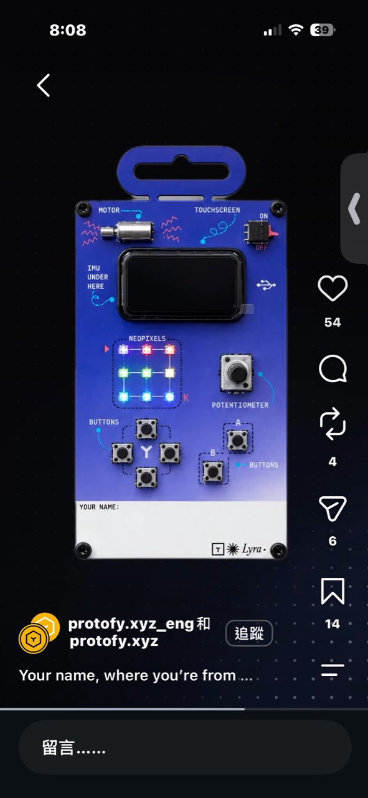
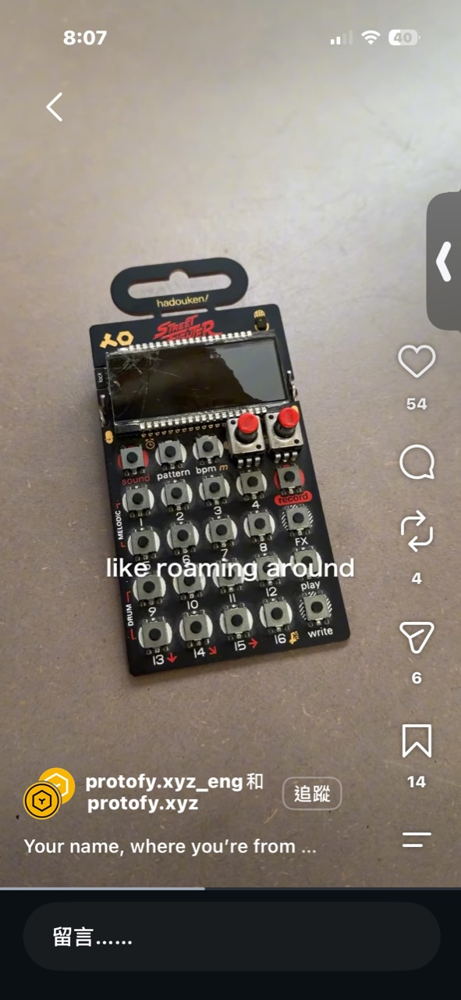
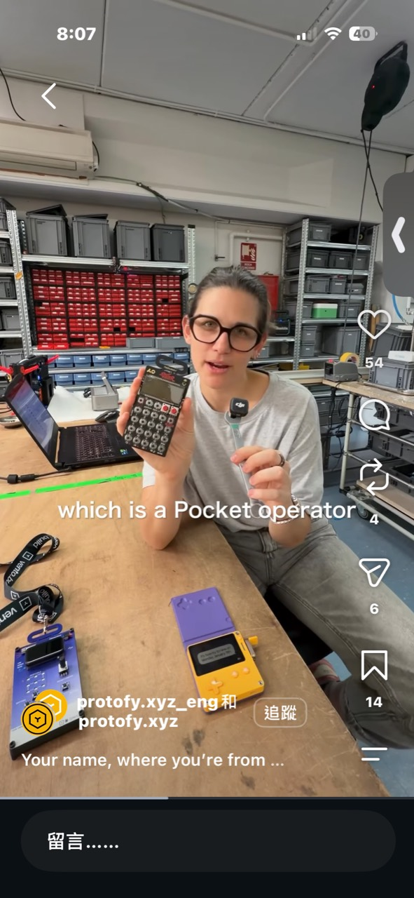
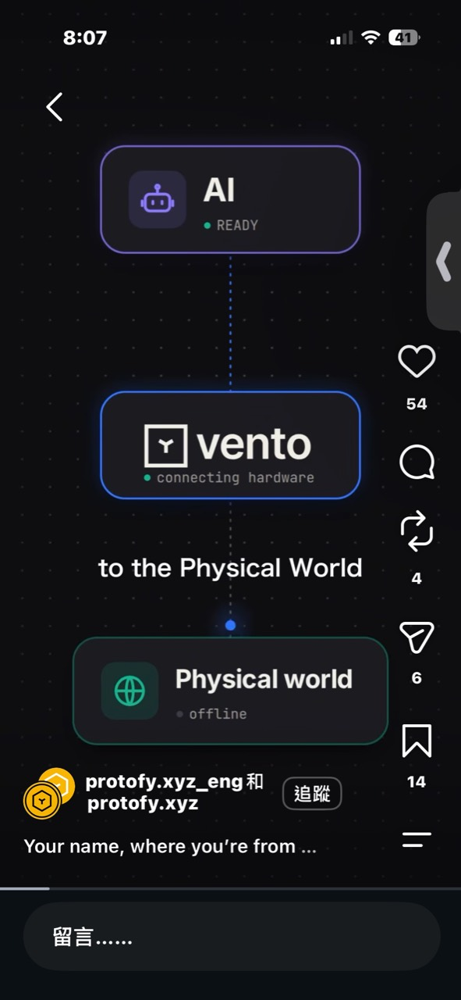
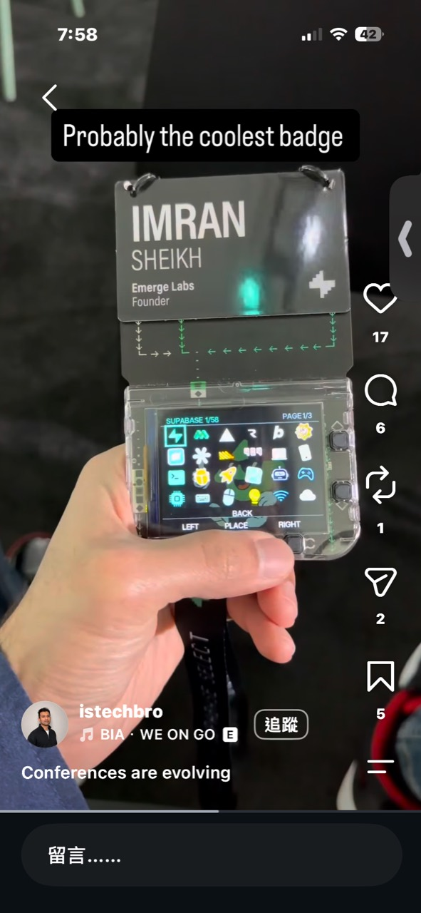

# Vento AI 實體原型平台

記錄日期：2026-10-03

## 靈感來源

Instagram 帳號 `protofy.xyz_eng`／`protofy.xyz` 展示一塊掛牌式藍色開發板、Teenage Engineering Pocket Operator，以及先前記錄的透明互動活動識別證。畫面把 Vento 描述為連接 AI 與實體世界的工具。

官方網站對 Vento 的定位是：用自然語言建立能連接真實裝置的系統，並可透過 MQTT 或 HTTP 串接開發板、感測器、攝影機與致動器，再加入 agent、API、webhook 和控制介面。Protofy 則是開發 Vento 的產品／工程團隊。

- Vento：<https://vento.build/>
- Protofy：<https://protofy.xyz/>

## 照片中的 Lyra 示範板

藍色 PCB 右下角印有 `Lyra`。照片可辨識的元件包括：

- 小型直流馬達。
- 小型觸控螢幕。
- 螢幕下方的 IMU。
- 3 × 3 NeoPixel 矩陣。
- 一個旋鈕／電位器。
- 十字方向鍵、A／B 鍵。
- 電源開關與 USB 接口。
- 掛繩孔與可填姓名的區域。

這些元件涵蓋輸入、顯示、光、動作與姿態感測，像是一張把常用硬體能力攤在正面的工作坊教學板。它比零散麵包板更容易讓第一次接觸硬體的人立即測試 AI 產生的程式。

照片只足以確認板面標示與元件，尚未找到官方公開的 Lyra 規格、原理圖、BOM 或售價；也不能僅憑同一支影片斷定透明 badge 內使用的就是這塊板。

## Pocket Operator 提供的產品設計參考

影片同時展示 Teenage Engineering 的 Pocket Operator。值得借鑑的不是複製其電路，而是它的產品語言：

- PCB 本身就是面板和外殼，減少額外結構件。
- 螢幕、按鍵與旋鈕直接形成明確的互動區域。
- 掛孔讓電子裝置看起來像可攜帶的卡片或樂器。
- 同一種硬體版型可由不同韌體和面板主題變成不同產品。

Lyra 把這種做法轉成「通用實體運算控制器」：不只做節奏機，也能做遊戲、燈光、馬達控制、感測器實驗或活動 badge。

## 真正值得借鑑的系統

Vento 展現的不是單一 DIY 成品，而是一個降低實體專案阻力的三層系統：

1. **AI 建構層**：使用者描述需求，平台協助產生控制邏輯、介面與 agent。
2. **標準硬體層**：固定的一組螢幕、按鍵、燈、馬達與感測器，讓範例不必每次重新接線。
3. **專案包裝層**：更換韌體、雷切／3D 列印外殼、紙面教材與故事，就能成為新作品。

這正好回應「想做電子專案，但手邊沒有硬體」的阻力。使用者買的不是一袋不知道怎麼接的零件，而是一塊已經測試完成的共同基座，以及持續增加的專案配方。

## 可轉成的套件商業模式

### 核心板＋低價專案包

- **核心板 NT$1,490～2,490**：螢幕、主控、按鍵、燈光、基本感測與 USB 供電。
- **專案包 NT$299～599**：機構零件、紙卡／壓克力面板、線材、韌體與逐步教材。
- **數位專案 NT$0～199**：只提供程式、AI prompt、模型檔與故事任務，使用既有核心板完成。

這會比每月重複附主控板更合理，也能把 499 元維持在「每個新作品的增量價格」，而非要求每盒都包含完整電子核心。

### 工作坊／學校版本

核心板由教室或活動主辦方重複使用，每位參加者只拿走自己完成的外殼、機構和作品資料。收入來自硬體租用、教材授權、講師服務與耗材包，也能降低電子垃圾。

## 成本判斷

照片中的 Lyra 類整合板若包含彩色觸控螢幕、IMU、NeoPixel、馬達、旋鈕、多顆按鍵、USB／電源電路與客製 PCB，小量材料粗估約 NT$900～1,800；加上測試、燒錄、包裝、損耗與售後，合理零售價可能落在 NT$1,500～3,000。這是依可見元件做的估算，不是官方 BOM。

若一定要將完整首購盒壓在 NT$500 左右，必須縮成無彩色觸控、無電池、少量按鍵和單一輸出的簡化板；它會失去「一板涵蓋多種專案」的優勢。較可行的 500 元策略是：核心板只買一次，後續每個主題包控制在 NT$299～599。

## 第一版建議

先不要一次整合所有元件。用現成 ESP32-S3 開發板做 20～50 套測試版，固定三種輸入和三種輸出：

- 輸入：方向鍵、旋鈕、IMU。
- 輸出：小螢幕、9 顆 RGB LED、小馬達或 servo 接口。
- 第一批內容：迷你遊戲、桌面節奏機、互動名牌。

三個專案共用同一塊板，才足以驗證顧客是否願意為「硬體基座＋持續更新的作品」付費，而不是只被其中一支短影片吸引。

## 圖片記錄

## 延伸筆記

- [可程式化電子活動識別證](可程式化電子活動識別證.md)
- [社群電子專案硬體套件平台](../Business/社群電子專案硬體套件平台.md)
