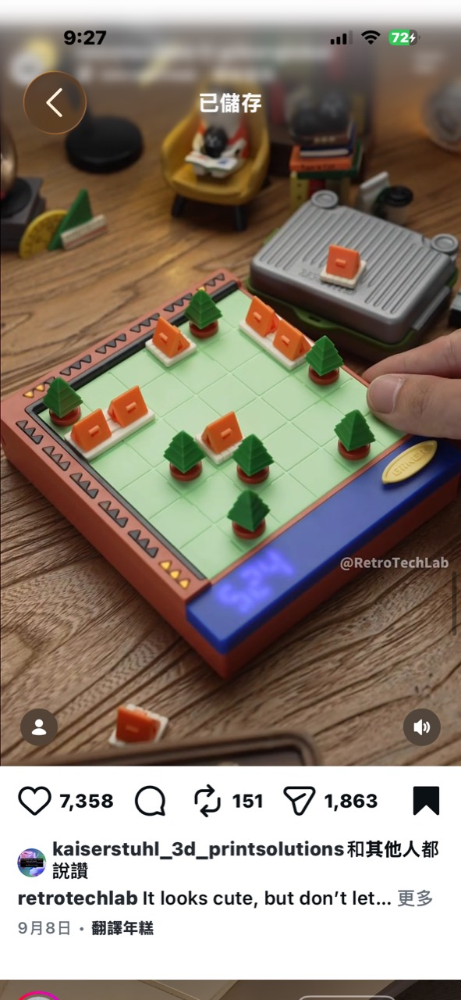

# 可辨識棋子的智慧城市格盤

記錄日期：2026-10-03

## 靈感來源與可信度

Instagram 帳號 `retrotechlab` 展示一塊復古電子遊戲機風格的方格盤，玩家把橘色房屋和綠色樹木放進格子，機身前方有藍色數字顯示與 `SELECT` 按鍵，旁邊盒子似乎可收納棋子。

目前未找到可核對的產品名稱、規則、BOM、影片拆解或銷售頁面。畫面的材質、光線、字樣和部分結構帶有 AI 概念渲染特徵，因此不能確認它是實際可運作產品。以下只把它當成「智慧實體棋盤」的設計提案。

## 概念核心

棋盤本身知道每個格子放了什麼棋子，並立即更新分數、資源或城市狀態：

- 房屋代表人口、收入或耗能。
- 樹木代表環境、遮蔭或碳匯。
- 鄰接與排列產生加分、扣分或連鎖效果。
- 玩家不需要手動輸入座標，放下棋子就是操作。
- 前方顯示器只呈現分數和回合，規則仍由實體物件承載。

它可以發展成城市規劃、氣候教育、邏輯解謎或單人每日挑戰，而不必模仿照片中未公開的遊戲規則。

## 棋子辨識方案

### 方案 A：磁鐵＋霍爾感測矩陣

每格放一顆數位或類比霍爾感測器，棋子底部加入磁鐵：

- 優點：沒有接點、棋子耐用、放上即可感應。
- 缺點：單一感測器通常只能確認有無或磁場強弱，不容易辨識很多棋種。
- 改良：房屋與樹木使用相反磁極或不同磁力，再以類比讀值分類。

適合 5 × 5 以下、棋種少的第一版。

### 方案 B：電阻編碼接點

每個棋子底部用兩個金屬接點和不同電阻值，格子讀取 ADC：

- 優點：成本最低，可辨識多種棋子。
- 缺點：接點會氧化、髒污，棋子方向和壓力可能造成接觸不良。
- 適合 DIY 教具，不適合飲料容易潑灑的兒童環境。

### 方案 C：NFC／RFID

每顆棋子貼 NFC 標籤，棋盤逐格或用移動讀頭掃描：

- 優點：每顆棋子可有唯一 ID，能保存角色和歷史。
- 缺點：每格一組讀取天線和多工器會迅速增加成本與射頻設計難度。
- 適合少量特殊格，不適合低價 8 × 8 全棋盤。

### 方案 D：上方攝影機辨識

相機辨識棋子顏色、形狀與格子位置：

- 優點：棋盤下方幾乎不需要大量感測器。
- 缺點：需要固定視角、均勻照明與較高算力，手部遮擋時容易誤判。
- 適合展場或使用手機支架的版本。

## 推薦第一版架構

做 5 × 5 棋盤，每格使用低價霍爾感測器，只有房屋、樹木和空格三種狀態：

- ESP32-C3 或 RP2040。
- 25 顆霍爾感測器，以多工器或矩陣掃描。
- 每顆棋子底部一顆小磁鐵。
- 四位數 LED／小 OLED 顯示分數。
- 一顆 SELECT 與一顆 RESET 按鍵。
- USB-C 供電，不附電池。
- 3D 列印棋子，棋盤使用印刷面板＋簡單塑膠或木框。

程式每次偵測棋盤變化後，更新：

1. 房屋總數。
2. 每間房屋周圍的樹木數。
3. 連續綠帶或住宅群加成。
4. 被房屋完全包圍的樹木扣分。
5. 回合限制與目標分數。

## 成本估算

### 25 格霍爾感測版

| 項目 | 小量原型 | 100 套目標 | 1,000 套目標 |
| --- | ---: | ---: | ---: |
| ESP32-C3／RP2040 控制核心 | NT$100～180 | NT$75～130 | NT$55～100 |
| 25 顆霍爾感測器＋多工 | NT$120～250 | NT$70～150 | NT$50～110 |
| LED／OLED 顯示與按鍵 | NT$70～180 | NT$50～120 | NT$35～90 |
| 客製 PCB／線路板 | NT$150～400 | NT$70～180 | NT$35～100 |
| 20～30 顆磁鐵 | NT$60～150 | NT$35～90 | NT$25～65 |
| 棋子、面板、框體 | NT$200～500 | NT$130～350 | NT$90～250 |
| USB 與其他五金 | NT$60～150 | NT$40～100 | NT$30～75 |
| 材料合計 | NT$760～1,810 | NT$470～1,020 | NT$320～790 |

售價仍需加入 SMT、磁鐵極性裝配、逐格感測校正、棋子分裝、包裝和售後。即使千套量產，完整智慧棋盤較合理的零售價仍約 NT$1,200～2,500。

## 能否壓到 NT$500

完整 25 格自動辨識棋盤不適合賣 NT$500，但可做三種簡化：

1. **九格版**：3 × 3、九顆感測器、六到九顆棋子，做單人邏輯題。
2. **單一感測區**：棋盤本身是普通印刷板，玩家每次把棋子放到讀取座登記，再移到格子。
3. **手機辨識版**：盒內只有棋子、紙棋盤與手機支架，使用網頁相機計分。

其中九格霍爾版在 500～1,000 套時，BOM 有機會約 NT$180～300，才能支撐 NT$499～699 的 DIY 套件售價。

## 周邊與隱藏成本

- 每顆磁鐵的方向必須一致，否則不同棋子的讀值會顛倒。
- 鄰格磁場可能互相干擾，需要保持距離並逐格校正門檻。
- 棋子太輕容易被磁鐵吸歪，太重則不適合兒童操作。
- 細小磁鐵有誤食風險，必須完全封裝且通過拉脫測試。
- 大面積 PCB 容易因尺寸增加成本，可拆成感測條或使用薄膜線路。
- 若使用 NFC，天線串擾、讀取距離和多工時間不能只靠軟體補救。

## 商業模式

核心棋盤買一次，後續販售：

- 新棋子包：學校、公園、工廠、道路、水域。
- 規則卡／關卡冊：城市規劃、碳排、人口與災害主題。
- 數位韌體包：同一棋盤切換成不同遊戲。
- 教室套裝：多組棋盤＋教師儀表板＋課程教材。

這比每月重複販售電子核心更合理；但若棋子要自動辨識，新的棋種必須遵守共同的磁力、ID 或電阻編碼規格。

## 圖片記錄

## 最終判斷

值得做的不是複製一張尚未證實的復古玩具畫面，而是把「擺放實體模型就改變模擬結果」變成可驗證產品。第一版應從九格、兩種棋子和霍爾感測開始；只要使用者不看說明也能理解放樹與蓋房如何改變分數，再擴成 25 格城市系統。
