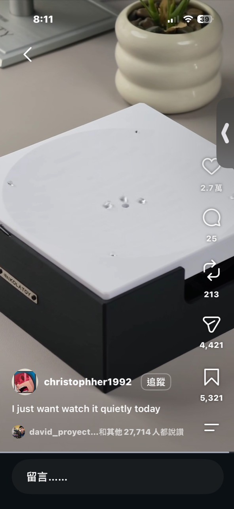
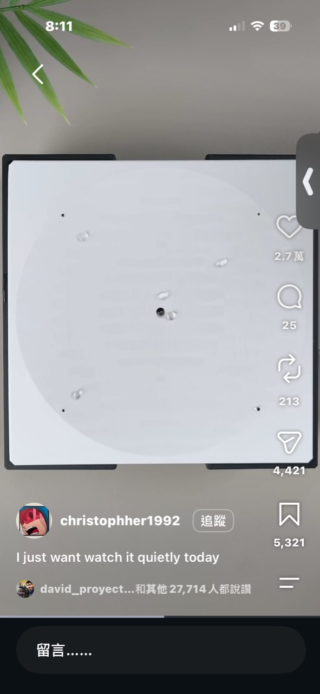
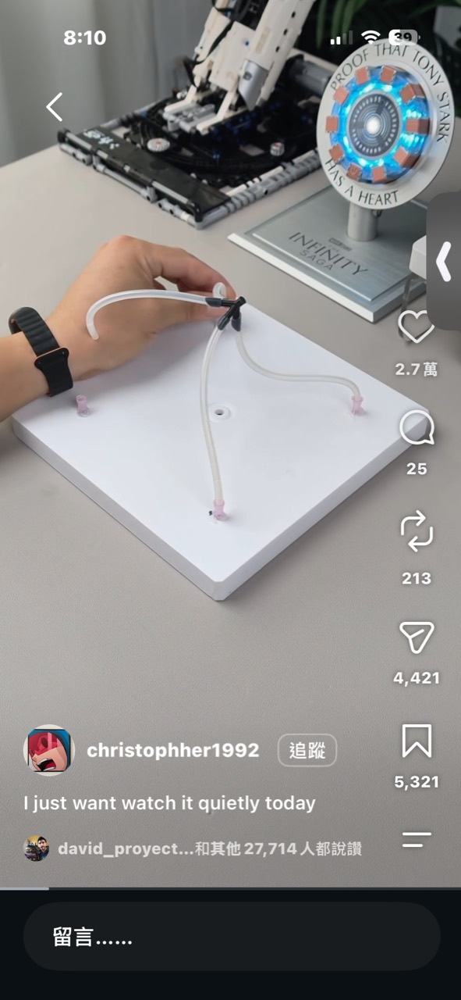
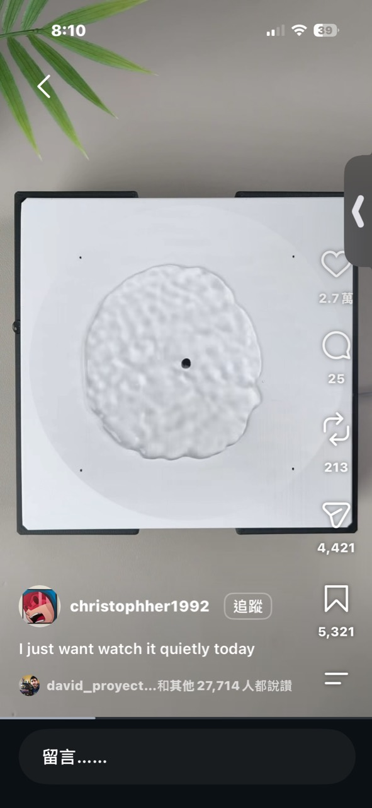

# 四點驅動可變形液滴桌面

記錄日期：2026-10-03

## 靈感來源

Instagram 帳號 `christophher1992` 展示一座黑色方盒，上方覆蓋白色方形工作面。數顆透明／銀色液滴或珠體會在表面緩慢移動、彼此聚合，最後在中央形成一片有細密紋理的圓形區域。

影片沒有顯示作品名稱、材料、控制器或完整驅動機構；盒身只能辨識到類似 `NIKOLATORY` 的銘牌。因此以下將它記錄為一種可變形表面動態裝置，而不把材料直接判定成水、鐵磁流體、液態金屬或特定非牛頓流體。

## 畫面可確認的結構

- 約正方形的白色上板／薄膜，中央有黑色定位點或開孔。
- 四周可看到數個小孔或固定點。
- 拆下上板後，背面有四個粉紅色接頭。
- 四條透明軟管、拉索或導管從不同方向匯向中央黑色零件。
- 工作面安裝在黑色箱體上，箱內應容納致動器、控制器和電源。

透明線材看起來像軟管，但單張照片無法確認它傳遞的是氣壓、液壓、機械拉力或只是柔性連接。也看不到致動端，因此不能確定是泵、servo、線性致動器、偏心馬達或喇叭。

## 可能的工作原理

最合理的共同原理是：四個致動點改變白色表面的局部高度、坡度、張力或振動相位，使表面上的材料沿能量較低的位置移動。

可能實作包括：

1. **氣動薄膜**：四路氣泵／電磁閥讓薄膜局部鼓起或下陷，液滴順著坡度移動。
2. **拉索變形**：四顆 servo 或步進馬達拉動透明線，使中央載台或薄膜形成可控制的傾斜。
3. **多點振動**：四個音圈、喇叭或偏心馬達改變表面波形，利用節點把珠粒聚集成圖案。
4. **移動磁場**：若表面材料含鐵磁成分，中央磁鐵或多組電磁鐵可吸引、合併與攤開液滴。

照片中「多顆物體朝中央聚合」可以由以上多種機制造成；除非找到作者拆解或影片拍到驅動器，不應把視覺效果直接等同於 ferrofluid。

## 物理效果

裝置的吸引力來自表面張力、重力、摩擦與外部驅動互相競爭：

- 小液滴傾向維持圓形，以減少表面能。
- 表面產生坡度後，重力分量使液滴滑向低處。
- 兩滴接觸時，表面張力會讓它們迅速合併。
- 週期性振動可把材料推向節點或腹部，形成環形、蜂巢或皺褶紋理。
- 若加入磁性液滴，磁場梯度能直接控制移動與變形；相關研究已展示以磁場搬運、合併和分裂液滴，但這只作為同類原理參考，不代表影片採用相同材料。

同類研究參考：

- [Programmable Digital Liquid Metal Droplets in Reconfigurable Magnetic Fields](https://pubs.acs.org/doi/10.1021/acsami.0c08179)
- [A novel magnet-actuated droplet manipulation platform using a floating ferrofluid film](https://www.nature.com/articles/s41598-017-15964-8)

## 可做成的版本

### 安靜的桌面藝術品

內建數組緩慢循環的動作：散開、相遇、融合、形成圓環，再重新分散。使用者不需要理解機構，只需觀看材料運動，定位接近動態沙畫桌與桌上冥想物件。

### 物理顯示器

讓中央材料形成時間、天氣或通知的抽象圖案。例如雨天產生密集波紋，專注模式只留下中央緩慢呼吸的圓。

### 科學教育套件

透明上蓋、可替換工作面與不同介質，讓使用者比較水珠、油珠、鋼珠、磁流體或細砂在不同頻率、坡度和磁場下的行為。

## 成本與套件化

若使用四顆小 servo、ESP32、柔性薄膜、雷切或 3D 列印框架、USB 供電與一般珠體，原型 BOM 粗估約 NT$700～1,300；完整套件合理售價可能落在 NT$1,500～2,500。

若採四路微型氣泵／電磁閥、密封腔體、特殊疏水表面或磁性液體，材料、漏氣測試與清潔風險都會提高，售價可能超過 NT$3,000。真正困難的不是控制板，而是長期可靠的工作面：不能滲漏、沾黏、乾掉或因灰塵失去一致性。

要做成 NT$499 級專案包，較實際的是讓顧客沿用既有核心板，只提供：

- 一至兩顆 servo。
- 彈性膜與簡化拉索機構。
- 少量鋼珠或塑膠珠，不使用自由液體。
- 3D 列印件、韌體和實驗卡。

這樣可以保留「表面像活的一樣」的效果，同時避開液體運送、密封與污染問題。

## 原型驗證順序

1. 先用四顆 servo 和細線控制一張彈性布，確認能否把 5～10 顆珠子移向指定區域。
2. 加入上方攝影機，追蹤珠子位置並做閉迴路控制。
3. 測試矽膠膜、TPU 薄片與疏水塗層的摩擦和耐久性。
4. 最後才測試液體或磁性介質，並加上可拆洗托盤與防漏邊界。

## 圖片記錄

## 最終判斷

這個點子值得收錄的不是某種神奇液體，而是「用少數致動器讓整張平面成為輸出裝置」。它把機構藏在極簡白色表面下，只留下緩慢、安靜且帶有生命感的物質運動。若要商品化，先用乾式珠體驗證動作和耐久，再決定是否值得承擔液體與密封的複雜度。
