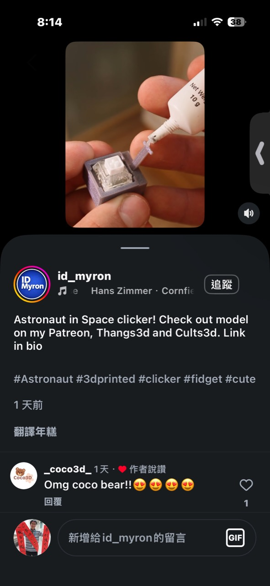
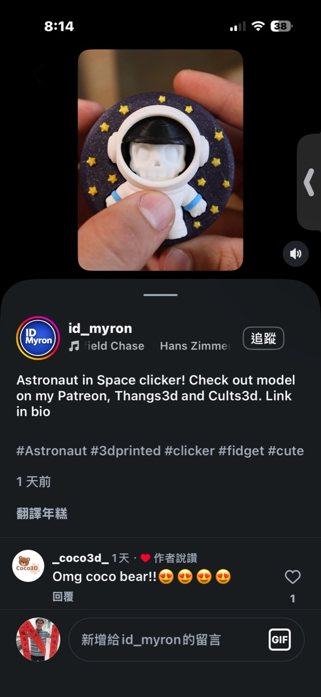
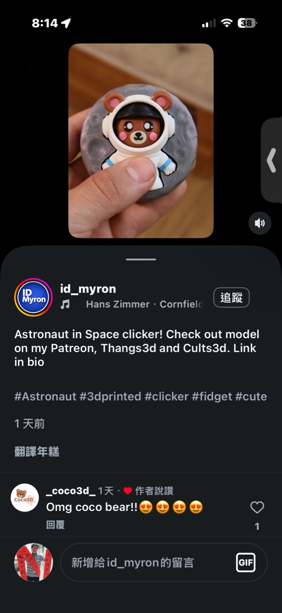
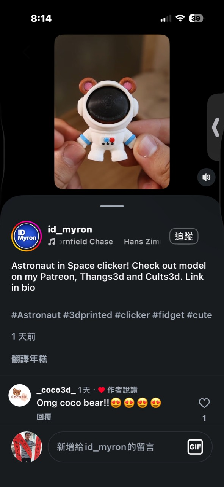

# 機械鍵軸太空人換臉按壓玩具

記錄日期：2026-10-03

## 靈感來源

Instagram 作者 `id__myron` 展示一款名為 `Astronaut in Space clicker` 的 3D 列印按壓玩具，並表示模型可在其 Patreon、Thangs3D 與 Cults3D 取得。

外觀是一名站在圓形月球／星空背板前的小太空人；按壓面罩中的角色臉會壓動藏在背後的機械鍵盤軸，產生清脆回彈。照片同時出現骷髏臉和熊臉版本，顯示同一太空人身體可以更換角色面板。

## 結構拆解

從組裝畫面可以看出核心是一顆標準十字軸心的機械鍵盤 switch：

1. 方形 3D 列印座固定鍵軸。
2. 角色臉或面罩背面設計十字插槽，直接套在軸心上。
3. 按下面罩時，鍵軸提供約數毫米行程、段落感、聲音與自動回彈。
4. 太空人身體遮住鍵軸，圓形背板同時提供握持面積和主題場景。
5. 分色列印或分件組裝形成頭盔、制服、星星、月球與角色臉。

照片第一張使用膠固定零件，但實際模型可能同時使用卡榫或壓配；沒有取得原始模型前，不把特定裝配方式視為完整規格。

## 為什麼效果成立

它把一顆非常成熟、便宜且耐按的標準零件重新包裝：

- 鍵軸負責所有手感和回彈，不必自行設計彈簧機構。
- 太空人面罩天然就是一個適合按壓的圓形區域。
- 臉部被按進頭盔的動作有明確的視覺反饋。
- 更換鍵軸即可改變聲音、壓力與段落感。
- 更換臉板、耳朵和背景就能衍生大量角色，而不用重做內部機構。

這是一個典型的「共用功能核心＋低成本造型包」產品。

## 可發展的產品線

### 可換臉系列

- 熊、貓、兔、骷髏、機器人或使用者自畫角色。
- 臉板採十字軸孔，像鍵帽一樣拆換。
- 背景可換成月球、行星、太空站或品牌 Logo。

### 手感收藏系列

同一外觀搭配不同鍵軸：

- 線性軸：安靜、滑順。
- 段落軸：有明確觸覺回饋。
- Clicky 軸：聲音最明顯，適合短影片展示。
- 靜音軸：適合辦公桌與教室。

包裝上可清楚標示聲音和按壓克數，讓使用者收集不同「角色個性」。

### 半成品工作坊

事先印好白色太空人和底座，參加者自行彩繪臉板、選鍵軸並完成組裝。它不需要焊接，也沒有電池安全問題，適合親子活動或 30～60 分鐘的快速體驗。

## 成本估算

以 100 件以上、單色／少量分色列印估算：

| 項目 | 粗估單件成本 |
| --- | ---: |
| 機械鍵軸 | NT$8～25 |
| PLA／PETG 耗材 | NT$10～30 |
| 膠、磁鐵或小五金 | NT$3～15 |
| 列印損耗與後處理 | NT$15～40 |
| 簡易包裝 | NT$10～25 |
| 合計 | 約 NT$46～135 |

若使用多色 AMS 長時間列印，換料塔浪費與機台時間可能高於材料本身。量產時更適合將零件拆成不同顏色分批列印，再以卡榫組裝。

### 售價判斷

- 單一完成品：NT$199～399。
- 含三張替換臉與兩種鍵軸：NT$399～599。
- 自印套件（鍵軸＋五金＋合法取得的模型／教材）：NT$149～299。

所以它很適合 NT$500 以下的入門商品，不需要沿用昂貴電子核心。真正的差異化不是 BOM，而是角色設計、可換面板、包裝故事和穩定列印品質。

## 授權注意事項

作者貼文引導使用者到 Patreon、Thangs3D 和 Cults3D 取得模型，但截圖沒有顯示授權條款。下載 STL 不等於取得販售列印成品的權利；要商品化必須確認：

- 是否僅限個人使用。
- 商用會員能否販售實體列印件。
- 是否需要標示作者。
- 商用資格停止訂閱後是否仍有效。
- 能否修改角色、Logo 或轉售套件。

若不購買商用授權，可以只借鑑「機械鍵軸＋可換臉公仔」的機構邏輯，重新設計完全不同的原創外觀與尺寸。

## 圖片記錄

## 最終判斷

這是目前收集案例中最接近「低風險、可在 NT$500 內成立」的商品之一。它利用機械鍵軸解決最難自行設計的手感和耐久問題，3D 列印只負責情緒價值與角色變化。第一版應做原創角色、三款可換臉和兩種不同手感的鍵軸，先驗證消費者是否願意為造型與收藏性重複購買。
