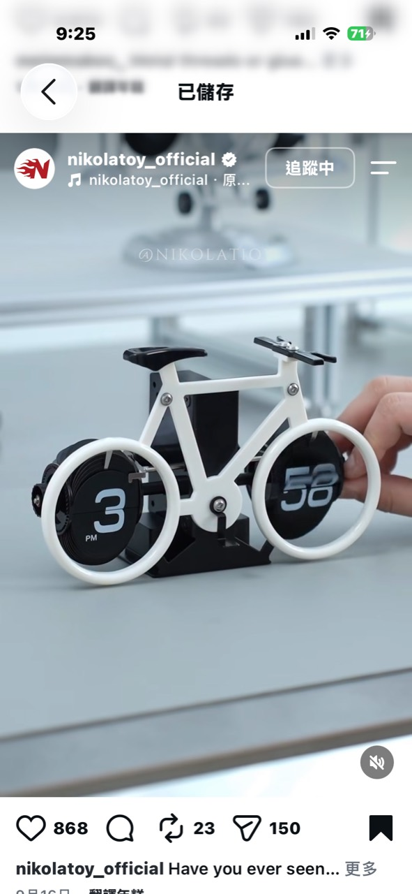

# 自行車雙輪自動翻頁鐘

記錄日期：2026-10-03

## 靈感來源

Instagram 帳號 `nikolatoy_official` 展示一座自行車造型桌鐘：前後輪的黑色圓盤分別顯示小時與分鐘，外圈白色輪框、車架、座墊與把手共同形成完整自行車輪廓。

NIKOLATOY 官網名稱為 **Creative Bicycle Automatic Page Turning Clock**，零售價 US$49.90，查詢時為售罄狀態。官方頁面沒有提供尺寸、材質、電源、機芯或內部結構，因此以下只將它確認為自動翻頁鐘，不把黑色顯示區誤判為圓形 LCD。

- [NIKOLATOY 官方產品頁](https://nikolatoy.com/products/creative-bicycle-automatic-page-turning-clock)

## 核心設計

- 前輪顯示小時，照片中為 `3 PM`。
- 後輪顯示分鐘，照片中為 `38`。
- 黑色數字頁面位於白色輪框內，翻動本身就像輪子轉動。
- 車架主要是固定、定位與敘事外殼，不必承擔真正騎乘結構的受力。
- 黑色底座隱藏機芯、傳動、電源和兩輪間的連接。

最大的創意是讓時鐘原本就存在的數字切換動作與自行車輪子形成同一個視覺隱喻，而不是在普通鬧鐘外面黏一個自行車模型。

## 可能的內部架構

在沒有拆機資料前，合理的重現方式有兩種：

### 方案 A：兩組現成翻頁機芯

- 小時輪：12／24 張數字頁。
- 分鐘輪：60 張數字頁，或十位與個位組合機構。
- 石英時基、同步馬達或小型步進馬達驅動。
- 兩組機芯由共同控制板校時。

優點是接近原作外觀；缺點是小尺寸圓形翻頁機構不常見，頁片、轉軸、間隙與噪音都需要精密裝配。

### 方案 B：旋轉數字鼓＋遮罩

- 在輪框內使用印有數字的圓盤或鼓輪。
- 步進馬達每分鐘轉到下一個索引位置。
- 前方遮罩只露出當前數字，視覺上模擬翻頁。

這個版本不具真正頁片翻轉效果，但更適合 DIY 套件：零件少、容易校正，也可用 3D 列印完成。

## 最核心元件與周邊

| 類別 | 元件 |
| --- | --- |
| 核心致動 | 兩組翻頁機芯，或兩顆低速步進馬達／減速馬達 |
| 時基 | 石英 RTC、32.768kHz 晶振或現成時鐘控制板 |
| 位置控制 | 霍爾感測器、光遮斷器或機械原點開關 |
| 傳動 | 齒輪、輪軸、頁片支架、軸套與止推結構 |
| 結構 | 黑色底座、白色車架與輪框、把手和座墊 |
| 電源 | AA 電池，或 USB 5V；照片無法確認原作方案 |
| 人機介面 | 校時按鍵、12／24 小時切換，選配 AM／PM 指示 |

這個專案的核心成本不是 MCU。簡單時鐘控制器只占很小比例，真正昂貴的是兩組安靜、不卡頁且能長期同步的機械顯示模組。

## 成本估算

### 小量 DIY 原型

| 項目 | 粗估 |
| --- | ---: |
| 兩顆步進／減速馬達 | NT$120～300 |
| 控制板、RTC、驅動與按鍵 | NT$100～250 |
| 頁片／數字鼓、齒輪、軸與五金 | NT$150～400 |
| 車架、輪框與底座列印 | NT$150～350 |
| 電源與線材 | NT$50～120 |
| 原型材料合計 | 約 NT$570～1,420 |

原型售價通常需 NT$1,500～2,500 才能負擔組裝、校正、失敗列印、包裝和售後。官方完成品 US$49.90 約為 NT$1,620，也落在這個級距。

### 大量生產推估

若使用射出車架、沖切／印刷頁片和客製共用控制板：

| 數量 | 推估硬體與結構成本／台 | 相對小量原型材料 |
| ---: | ---: | ---: |
| 100 台 | NT$450～850 | 約低 25～40% |
| 500 台 | NT$320～650 | 約低 40～55% |
| 1,000 台 | NT$260～550 | 約低 50～60% |

以上不含模具、開發、認證、國際運費與不良品。若直接向原廠或代工廠採購既有成品，應以官方批發聯絡方式取得 RFQ；官網只公開兩件以上 8% 折扣，並未公布 100／500／1,000 台批發價。

## 能否做到 NT$500

### 完成品零售：不合理

即使千台材料有機會接近 NT$260～550，加上模具攤提、人工裝配、校時測試、包裝、通路和售後，NT$500 完成品幾乎沒有健康毛利。

### DIY 簡化版：有機會接近

- 只做一個輪子，顯示 0～59 或 1～12。
- 使用手動旋鈕或單一低速馬達。
- 數字鼓取代真正翻頁片。
- USB 供電，不附電池。
- 使用紙卡車架或少量平面列印件。

這類「單輪機械數字顯示教具」的 BOM 有機會控制在 NT$220～320，售價 NT$499；兩輪完整自行車則應定位為 NT$999～1,999 的進階機構盒。

## 對產品平台的啟示

這個案子不適合套用彩色螢幕核心，反而應與凸輪七段顯示器、薛西弗斯計數器和平交道模型共用「低速馬達＋RTC＋原點感測」平台。共同控制板很便宜，後續專案包的差異集中在齒輪、凸輪、頁片與故事外觀。

## 圖片記錄

## 最終判斷

這是一件機構價值遠高於電子價值的產品。若要自己做，不該先設計漂亮自行車外殼，而應先讓兩組裸機芯連續運轉一週，確認不會漏翻、重複翻、卡頁或逐漸失去同步；機構可靠後再把輪框和車架變成商品外觀。
