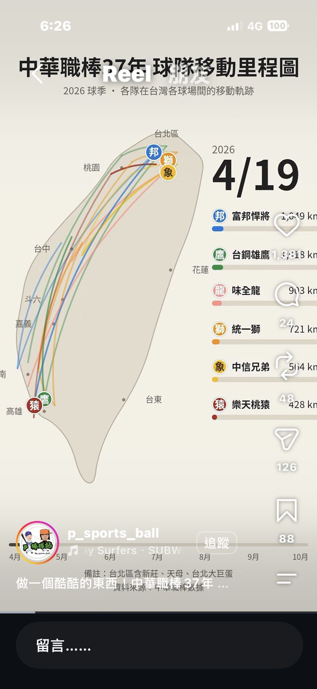
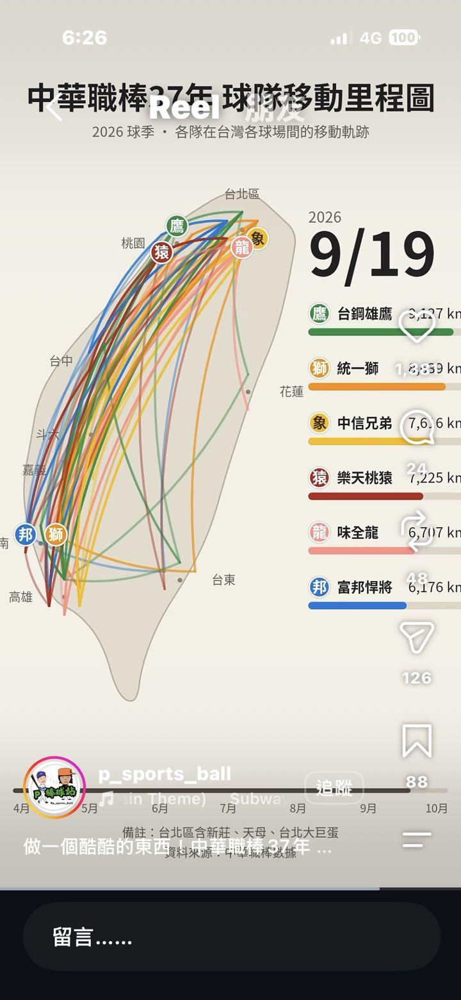

# 球隊移動里程地圖

更新日期：2026-10-07  
靈感來源：Instagram 帳號 p_sports_ball 短影片「中華職棒 37 年 球隊移動里程圖」  
靈感截圖：`assets/team-travel-mileage-0419.jpg`、`assets/team-travel-mileage-0919.jpg`  
狀態：靈感庫／未選定落地方向  
紀錄者：Web Idea

## 一句話

把球隊整季在各球場之間的移動，一天一天畫在地圖上，同時排出每隊累積了幾公里。

## 靈感影片內容

- 2026 球季中華職棒六隊在台灣各球場之間的移動軌跡，用弧線一天一天畫在台灣地圖上。
- 右側同步排出各隊累積公里數的條形圖：4/19 富邦悍將領先；到 9/19 台鋼雄鷹約八千多公里最多。
- 底部是四月到十月的時間軸。
- 資料來源：中華職棒賽程。

## 想擴充的方向

- 美國職籃（NBA）：三十隊、跨時區的長途移動，可加上背靠背客場與時差。
- 美國職棒（MLB）：一百六十二場賽程，移動量更大，可比較東西岸球隊的里程差距。
- 其他應用（建議）：
  - 巡迴演唱會：把歌手或樂團的巡演城市與累積里程畫成動畫。
  - 健行或旅行紀錄：把個人一年的行程累積成地圖動畫與里程榜。
  - 其他聯賽：日本職棒、歐洲足球聯賽等。

## 相關點子

- Listmap「把移動畫在地圖上」：可共用地圖弧線動畫與時間軸播放元件。

